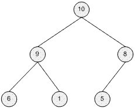

# Heap Data Structure

Important links:

1. [master-heap-by-solving-23-questions-in-4-patterns-category](https://leetcode.com/discuss/general-discussion/1127238/master-heap-by-solving-23-questions-in-4-patterns-category)

The heap is a data structure which is a special kind of complete binary tree. The main distinction is that a Heap stores its nodes in a partial order. 

- the nodes are filled from left to right so that if a specific node has no left child, it should have no right child too.
- if there is a node in level h, the level h - 1 should be fulfilled

The following is a formal definition of the Heap [from Computer Algorithms by S. Baase and A. Van Gelder]:

*A binary tree V is a Heap structure if and only if it satisfies the following conditions:*

1. *V is complete at least through depth h - 1*
2. *All leaves are at depth h or h - 1*
3. *All paths to a leaf of depth h are to the left of all paths to a leaf of depth h - 1*

There are two kinds of Binary Heaps - **minheap** and **maxheap**. 

*A minheap is a Heap for which each node's priority is less than or equal to its children's priorities.* 

*A maxheap is a Heap for which each node's priority is greater than or equal to its children's priorities.*



Example of **maxheap**


Example of **minheap**

*A heap is typically represented using an **array data structure** the above two heaps are represented as follows [10, 9, 8, 6, 1, 5] and [1, 2, 5, 8, 10]*

Given a heap represented by an array **arr** 

- parent of node[i]  = arr[i - 1]/2
- left child: 2i + 1
- right child: 2i + 2

## HeapSort

Time complexity **O(NLogN) N is number of nodes in the heap**

```jsx
1. Swap last element with max element (index = 0)
2. reduce size of heap
3. Max heapify(0)

# Time complexity of heapsort is O(NlogN)
def heapSort(self):
    for i in range(len(self.arr)- 1, 0, -1):
        self.swap(0, i)
        self.size -=1
      self.max_heapify(0)
```

## Priority Queue

A priority queue is a data structure that stores elements along with their associated priorities and allows for efficient retrieval of the element with the highest (or lowest) priority. It's commonly used in scenarios where elements need to be processed based on their priority rather than the order of insertion.